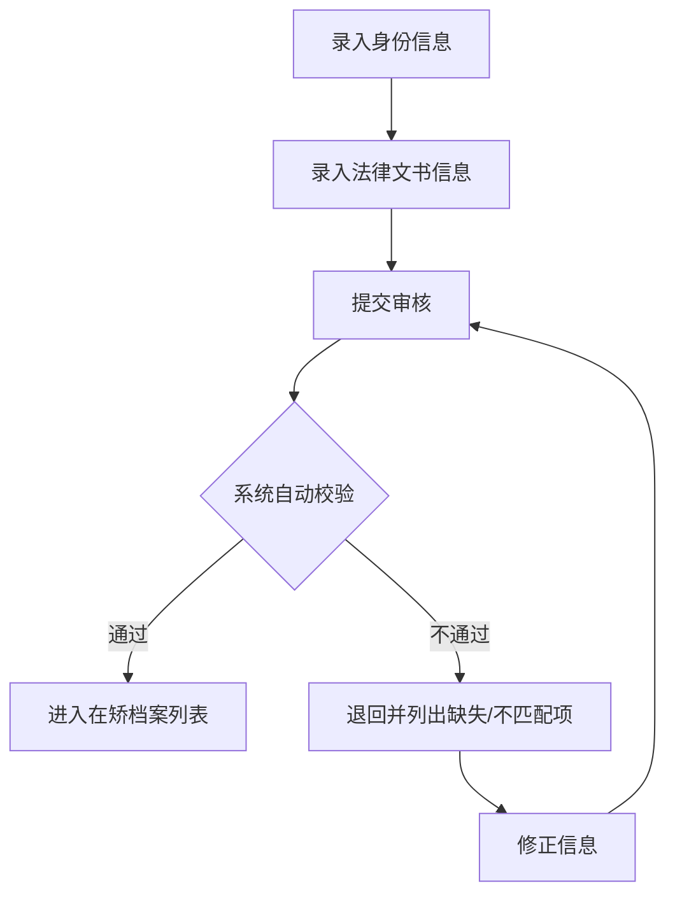
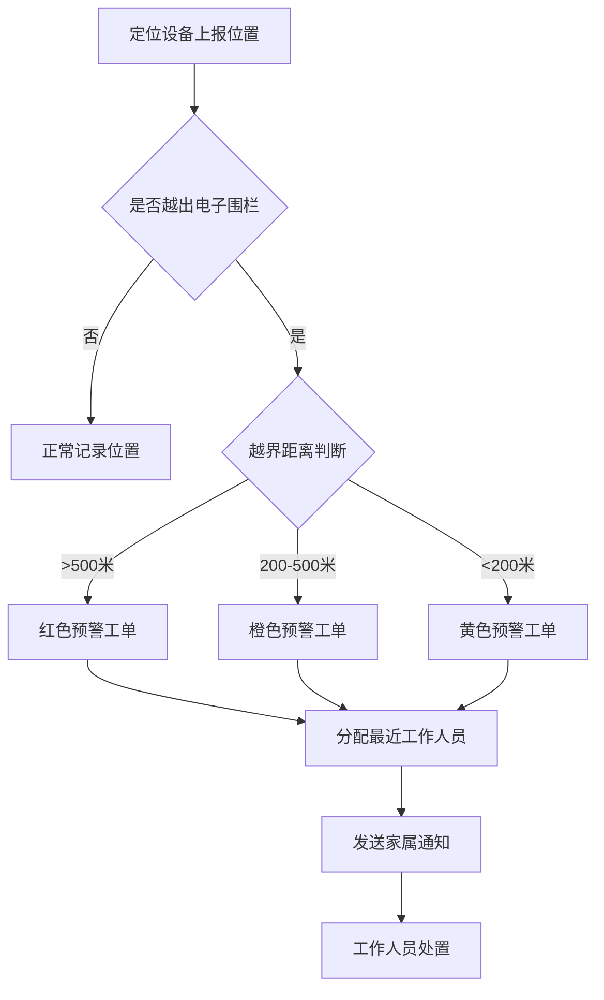
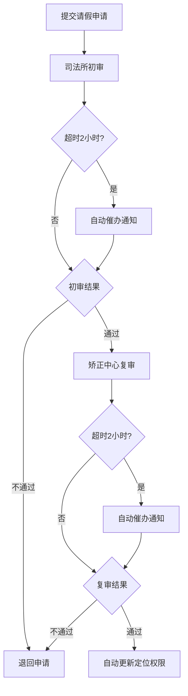

## 1. 产品概述

社区矫正管理系统是面向司法行政机关的信息化监管平台，用于对社区矫正对象进行全流程数字化管理，涵盖入矫审核、定位监控、报到管理、学习考核、请假审批、解矫评估及监管报表等核心业务，实现监管规范化、预警实时化、考核智能化。

- 目标用户：社区矫正工作人员、司法所管理员、矫正中心审批人员、区县监管领导
- 核心价值：提高监管效率，降低脱管漏管风险，确保社区矫正工作依法合规

## 2. 核心功能

### 2.1 用户角色

| 角色 | 注册方式 | 核心权限 |
|------|---------|---------|
| 司法所工作人员 | 系统分配 | 入矫初审、报到登记、请假初审、日常监管 |
| 矫正中心审批员 | 系统分配 | 入矫复审、请假复审、预警处置、综合评估 |
| 监管领导 | 系统分配 | 查看日报、统计报表、解矫名单导出、全局数据监控 |
| 社区矫正对象 | 系统登记 | 在线学习、答题考核、请假申请、报到提醒 |

### 2.2 功能模块

1. **入矫审核**：身份信息录入、法律文书录入、自动一致性校验、退回/通过、在矫档案列表
2. **定位预警**：设备位置上报、电子围栏判断、分级预警工单、最近工作人员分配、家属通知记录
3. **报到管理**：定期报到校验、周期合规性检查、逾期催告任务、权益暂停/恢复
4. **学习考核**：教育学习计划自动生成、在线学习、答题考核、不合格补充学习
5. **请假审批**：两级审批流转（司法所初审→矫正中心复审）、超时催办、定位权限自动更新
6. **解矫评估**：监管记录汇总、考核结果综合、自动生成评估报告、解矫名单导出
7. **监管日报**：每日凌晨自动生成、区县统计（在矫人数/违规率/教育完成率）、按日期区域筛选导出

### 2.3 页面详情

| 页面名称 | 模块名称 | 功能描述 |
|---------|---------|---------|
| 首页仪表盘 | 统计概览卡片 | 展示在矫人数、今日预警、待审批请假、逾期报到等核心指标 |
| 首页仪表盘 | 快捷入口 | 7大功能模块的卡片式快捷入口，带图标和简述 |
| 入矫审核 | 入矫登记表单 | 身份信息（姓名/身份证/住址）+ 法律文书信息（判决文号/罪名/矫正期限） |
| 入矫审核 | 校验结果弹窗 | 自动比对一致性，列出缺失项和不匹配项，支持退回或修正后通过 |
| 入矫审核 | 在矫档案列表 | 已通过的矫正对象档案，支持搜索、筛选、查看详情 |
| 定位预警 | 位置监控面板 | 模拟地图显示设备位置、电子围栏范围、越界点标记 |
| 定位预警 | 预警工单列表 | 按等级（红/橙/黄）分类，显示分配人员、家属通知状态、处置状态 |
| 定位预警 | 工单详情弹窗 | 位置轨迹、越界时间、工作人员信息、家属通知记录、处置操作 |
| 报到管理 | 报到日历 | 显示当月报到计划、已报到/逾期状态标记 |
| 报到管理 | 催告任务列表 | 逾期未报到对象列表，支持发送催告、暂停权益操作 |
| 学习考核 | 学习计划列表 | 根据矫正方案生成的学习任务，显示完成进度、截止日期 |
| 学习考核 | 答题考核页面 | 随机题库、限时答题、自动评分、不合格触发补充学习 |
| 请假审批 | 请假申请表单 | 请假事由、时间、去向、联系人信息录入 |
| 请假审批 | 审批流程面板 | 两级审批节点展示、当前状态、超时倒计时、催办按钮 |
| 请假审批 | 对象详情页 | 显示矫正对象信息、定位权限状态更新、请假历史 |
| 解矫评估 | 综合评估报告 | 自动汇总监管记录、考核得分、违规次数，生成评估结论 |
| 解矫评估 | 解矫名单导出 | 按时间段筛选，支持导出为 CSV 文件 |
| 监管日报 | 日报展示页 | 各区县在矫人数、违规率、教育完成率统计图表 |
| 监管日报 | 筛选导出 | 按日期、区域筛选，支持导出 CSV 文件 |

## 3. 核心流程

### 3.1 入矫审核流程

工作人员录入身份信息与法律文书信息 → 系统自动比对一致性 → 校验通过则进入在矫档案 → 校验失败则退回并列出缺失/不匹配项 → 修正后重新提交

### 3.2 定位预警流程

定位设备实时上报位置 → 系统判断是否越出电子围栏 → 根据越界距离生成红/橙/黄级预警 → 自动分配最近社矫工作人员 → 自动通知家属 → 工作人员处置工单

### 3.3 请假审批流程

矫正对象提交请假申请 → 司法所初审（2小时超时催办）→ 矫正中心复审（2小时超时催办）→ 审批通过自动更新定位权限 → 审批不通过退回

## 4. 用户界面设计

### 4.1 设计风格

- **主色调**：深蓝 (#1e3a5f) + 政务蓝 (#2563eb)，体现司法系统的严肃专业感
- **辅助色**：预警红 (#dc2626)、预警橙 (#ea580c)、预警黄 (#ca8a04)、成功绿 (#16a34a)
- **中性色**：浅灰背景 (#f1f5f9)、白色卡片 (#ffffff)、深灰文字 (#1e293b)
- **按钮风格**：圆角 6px，扁平设计，点击有微缩反馈动画
- **字体**："PingFang SC"、"Microsoft YaHei"，正文 14px，标题 16-20px，数字用等宽字体增强可读性
- **布局风格**：左侧侧边栏导航 + 顶部统计条 + 主内容区卡片式布局
- **图标风格**：线性图标 (Lucide Icons)，统一 20px 尺寸

### 4.2 页面设计概览

| 页面名称 | 模块名称 | UI 元素 |
|---------|---------|---------|
| 首页仪表盘 | 统计概览 | 4张渐变统计卡片（在矫人数/今日预警/待审批/逾期报到），数字放大显示，趋势小箭头 |
| 首页仪表盘 | 快捷入口 | 2行4列彩色图标卡片，悬停有上浮+阴影动画 |
| 入矫审核 | 表单 | 双栏布局（左身份/右文书），必填项红星标记，底部操作按钮组 |
| 入矫审核 | 校验弹窗 | 红色标签标注问题项，分"缺失项"和"不匹配项"两栏列表 |
| 定位预警 | 监控面板 | 模拟区域地图，圆形电子围栏，实时位置点，越界点闪烁动画 |
| 定位预警 | 工单列表 | 三级色标签（红/橙/黄），状态徽章，操作按钮悬停变色 |
| 请假审批 | 流程面板 | 横向审批时间线，节点带颜色状态，超时节点闪烁警告 |
| 监管日报 | 统计图表 | 柱状图（各区县在矫人数）、折线图（违规率趋势）、环形图（教育完成率） |

### 4.3 响应式设计

- 采用桌面端优先设计（min-width 1280px）
- 侧边栏在 1024px 以下收起为图标模式
- 表格在移动端支持横向滚动
- 弹窗表单自适应宽度

### 4.4 动效设计

- 页面加载：内容区淡入 + 轻微上移（0.4s ease-out）
- 卡片悬停：上浮 4px + 阴影加深（0.2s transition）
- 预警闪烁：红色预警点呼吸动画（opacity 0.3-1 循环 1.2s）
- 表单校验错误：输入框红色边框抖动（0.3s）
- 审批流程节点：通过节点绿色勾选动画
