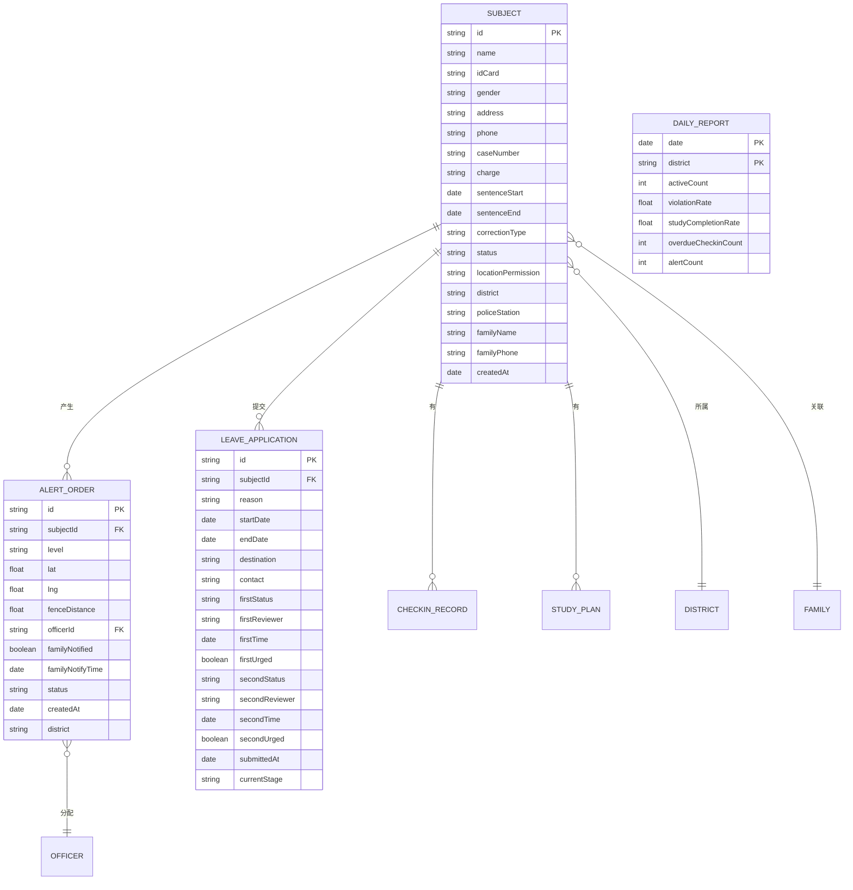

## 1. 架构设计

```mermaid
flowchart LR
    subgraph "前端层 (React + Vite"
        A["UI 组件层 (Pages/Components)
        B["状态管理层 (Zustand)"]
        C["路由层 (React Router)"]
    end
    subgraph "数据层"
        D["本地持久化 (localStorage)
        E["Mock 数据服务层"]
    end
    subgraph "外部库/组件库"
        F["Lucide Icons"]
        G["Chart.js / Recharts"]
        H["Tailwind CSS 样式"]
    end
    A --> B
    A --> C
    B --> D
    B --> E
    A --> F
    A --> G
    A --> H
```

## 2. 技术描述

- **前端框架**：React@18 + TypeScript + Vite@5
- **构建工具**：Vite（快速开发构建，HMR 热更新）
- **样式方案**：Tailwind CSS@3（原子化CSS，快速构建政务风格界面）
- **路由管理**：React Router@6（SPA 路由，管理各模块页面导航）
- **状态管理**：Zustand@4（轻量级状态管理，支持数据持久化中间件）
- **数据持久化**：localStorage + 封装本地持久化库（模拟后端，确保刷新后数据保留）
- **图表库**：Recharts@2（监管日报统计图表展示）
- **UI 图标**：Lucide React（线性图标，契合政务风格）
- **日期处理**：date-fns（日期格式化、周期计算、超时判断）
- **后端**：无后端（纯前端原型，数据通过 Mock 数据 + localStorage 模拟）
- **数据库**：localStorage（模拟数据持久化）

## 3. 路由定义

| 路由路径 | 页面名称 | 功能说明 |
|-----------|---------|---------|
| / | 首页仪表盘 | 统计概览 + 7大模块快捷入口 |
| /intake | 入矫审核 | 登记表单 + 校验 + 在矫档案列表 |
| /location | 定位预警 | 位置监控 + 预警工单列表 + 工单详情 |
| /checkin | 报到管理 | 报到日历 + 逾期催告任务 |
| /study | 学习考核 | 学习计划 + 在线答题考核 |
| /leave | 请假审批 | 请假申请 + 两级审批流程 + 对象详情 |
| /release | 解矫评估 | 综合评估报告 + 解矫名单导出 |
| /report | 监管日报 | 日报统计 + 筛选导出 |

## 4. API 定义（模拟服务层函数签名）

```typescript
// 矫正对象相关
interface Subject {
  id: string;
  name: string;
  idCard: string;
  gender: '男' | '女';
  address: string;
  phone: string;
  // 法律文书
  caseNumber: string;
  charge: string;
  sentenceStart: string;
  sentenceEnd: string;
  correctionType: string;
  // 状态
  status: 'pending' | 'active' | 'released';
  locationPermission: 'normal' | 'expanded' | 'restricted';
  createdAt: string;
  district: string;
  policeStation: string;
  // 家属
  familyName: string;
  familyPhone: string;
}

// 预警工单
interface AlertOrder {
  id: string;
  subjectId: string;
  subjectName: string;
  level: 'red' | 'orange' | 'yellow';
  location: { lat: number; lng: number };
  fenceDistance: number;
  assignedOfficer: { name: string; phone: string; station: string };
  familyNotified: boolean;
  familyNotifyTime?: string;
  status: 'pending' | 'processing' | 'resolved';
  createdAt: string;
  district: string;
}

// 请假申请
interface LeaveApplication {
  id: string;
  subjectId: string;
  subjectName: string;
  reason: string;
  startDate: string;
  endDate: string;
  destination: string;
  contact: string;
  // 审批节点
  firstReview: { status: 'pending' | 'approved' | 'rejected'; reviewer?: string; time?: string; urged?: boolean };
  secondReview: { status: 'pending' | 'approved' | 'rejected'; reviewer?: string; time?: string; urged?: boolean };
  submittedAt: string;
  currentStage: 'first' | 'second' | 'completed';
}

// 监管日报
interface DailyReport {
  date: string;
  district: string;
  activeCount: number;
  violationRate: number;
  studyCompletionRate: number;
  overdueCheckinCount: number;
  alertCount: number;
}

// 服务函数类型签名
type SubjectService = {
  create(data: Partial<Subject>): { success: boolean; errors?: ValidationError[] };
  validate(data: Partial<Subject>): ValidationError[];
  list(filters?: any): Subject[];
  get(id: string): Subject | undefined;
  updateLocationPermission(id: string, perm: Subject['locationPermission']): void;
};

type AlertService = {
  simulateLocationReport(subjectId: string, location: {lat, lng}): AlertOrder | null;
  list(filters?: any): AlertOrder[];
  updateStatus(id: string, status: AlertOrder['status']): void;
};

type LeaveService = {
  submit(data: Partial<LeaveApplication>): LeaveApplication;
  reviewFirst(id: string, approved: boolean, reviewer: string): void;
  reviewSecond(id: string, approved: boolean, reviewer: string): void;
  urgeIfTimeout(id: string): boolean; // 检查并标记催办
  list(filters?: any): LeaveApplication[];
};

type ReportService = {
  generateDaily(date: string): DailyReport[];
  exportCSV(data: any[], filename: string): void;
  getReleaseList(startDate: string, endDate: string, district?: string): Subject[];
};
```

## 5. 数据模型

### 5.1 ER 图



### 5.2 localStorage 存储键设计

```typescript
// localStorage keys
const STORAGE_KEYS = {
  SUBJECTS: 'sjz_subjects',          // 在矫对象列表
  ALERT_ORDERS: 'sjz_alerts',      // 预警工单
  LEAVE_APPS: 'sjz_leaves',         // 请假申请
  CHECKIN_RECORDS: 'sjz_checkins',   // 报到记录
  STUDY_PLANS: 'sjz_study',          // 学习计划
  DAILY_REPORTS: 'sjz_reports',      // 监管日报
}
```

初始化时自动注入 mock 数据（如 localStorage 为空。
